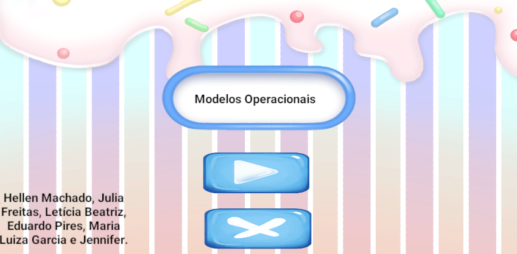
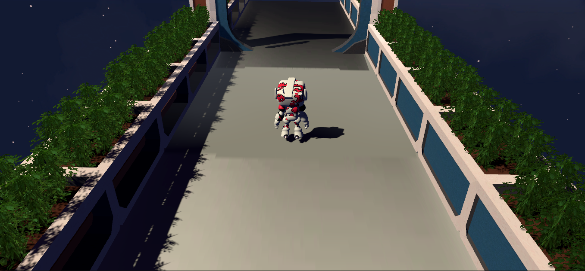
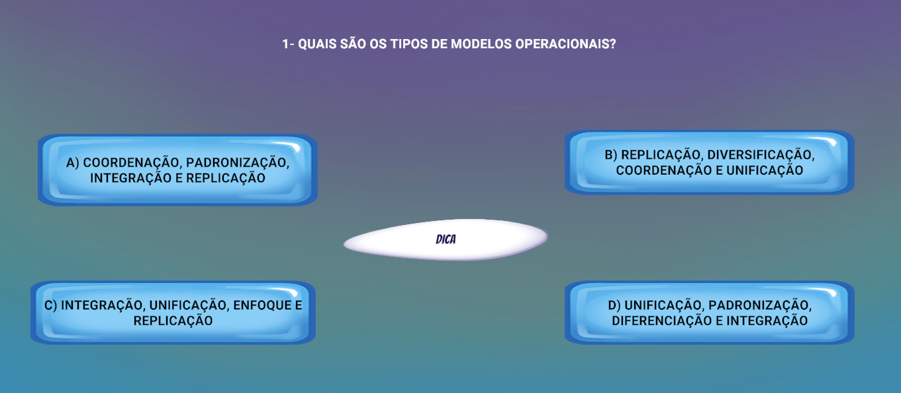
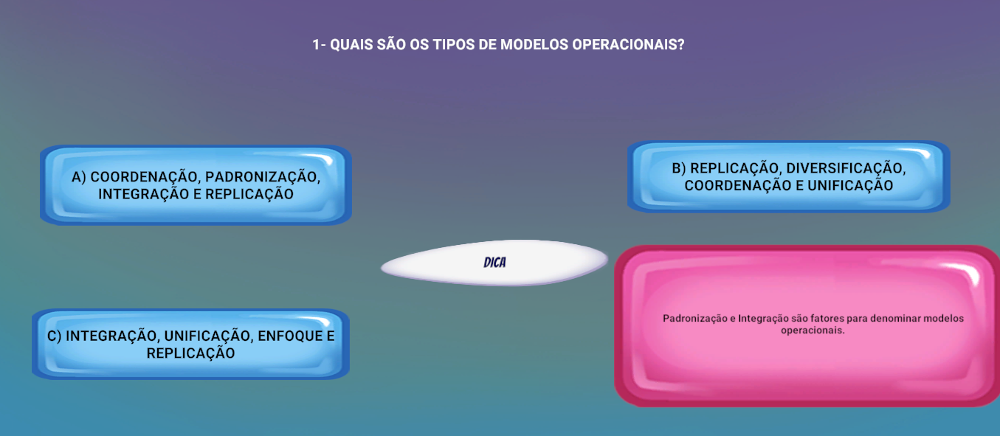
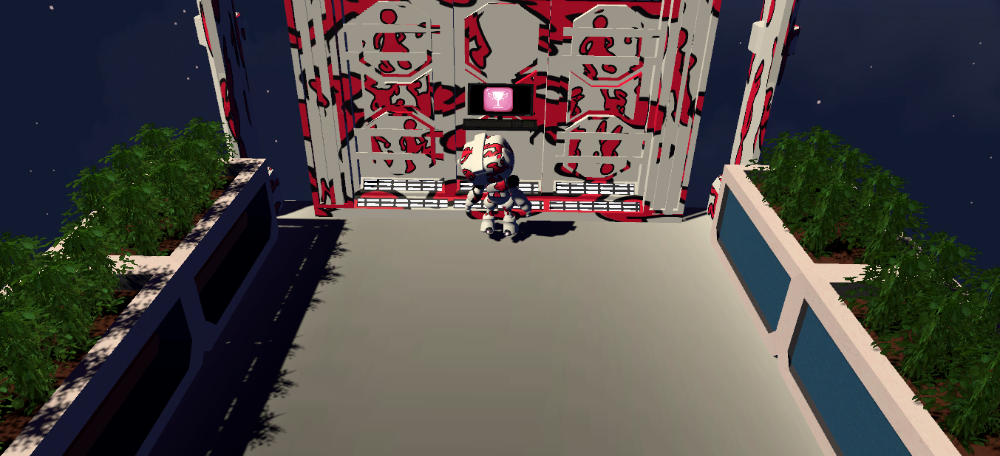
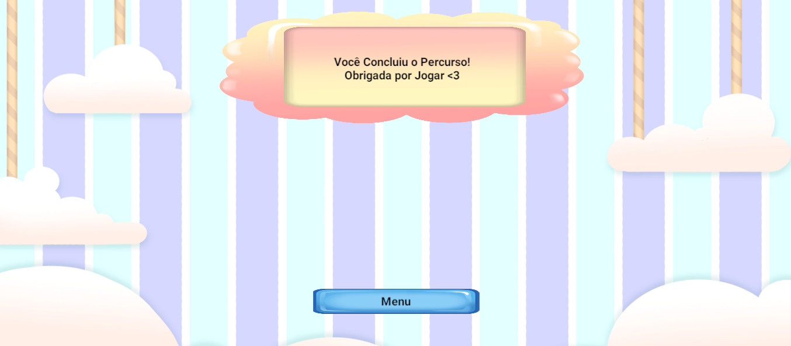

# Projeto de Modelos Operacionais

Projeto simples da faculdade de Sistema de Informação. O professor passou para a turma realizar jogos como preferir com o tema de Modelos Operacionais, o escolido por minha equipe foi realizar um jogo na Unity com perguntas de vários modelos operacionais em C++.

# Menu

# Câmera e Personagem

# Modelo das Perguntas

# Modelo das Dicas

# Tela de Vitória

# Tela de Final de jogo

